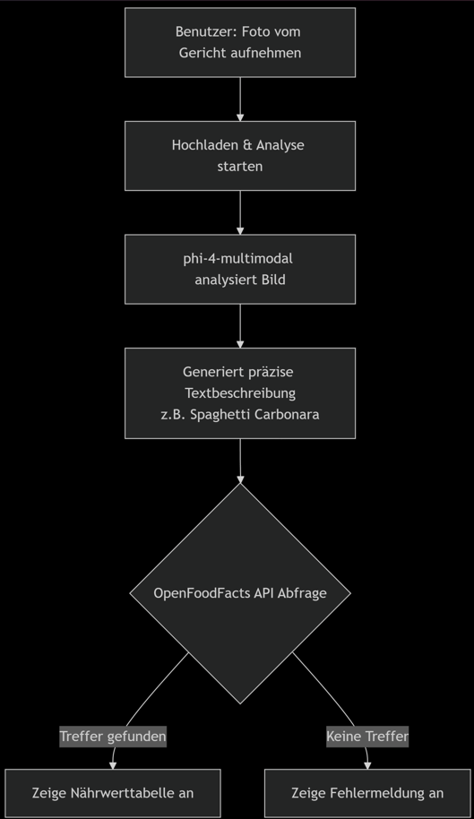

# SmartBite
SmartBite ist eine moderne, KI-gestützte Webanwendung zur automatisierten Kalorien- und Nährwerterkennung von Mahlzeiten. Sie richtet sich speziell an Sportler:innen und gesundheitsbewusste Nutzer:innen, die ihren Ernährungsplan einfach und zeitsparend tracken möchten. Der Kern des Systems ist die Kombination eines Large Language Models (phi-4-multimodal) zur Bildbeschreibung und einer externen API zur Nährwertabfrage.

- Projektstatus: Funktionaler Prototyp (MVP)

- Letzte Aktualisierung: 05.09.2025

- Autor: Youssef Elkettani

## Funktionen
- Benutzer können Accounts erstellen und sich anmelden.
- Daten werden in einer Postgresql-Datenbank gespeichert.
- Bilder hochladen.
- Nährungswerte der Gerichte können gespeichert werden.

## Architekturübersicht


## Dienste

### Frontend (Streamlit):
   - Rolle: Stellt die nutzerzentrierte Weboberfläche bereit.
   - Funktionalität: Bild-Upload, Anzeige der analysierten Nährwerte, Interaktion mit dem Backend.
### KI-Service (phi-4-multimodal):
   - Rolle: Hochpräzise Bildanalyse und -beschreibung.
   - Funktionalität: Empfängt das hochgeladene Bild und generiert eine äußerst detaillierte und akkurate textuelle Beschreibung (z.B. "Spaghetti...").
### Externe API (OpenFoodFacts):
  - Rolle: Bereitstellung der Nährwertdaten.
### Backend-Service (FastAPI):
  - Rolle: Zentrale Geschäftslogik und Nutzerdatenverwaltung.
### Datenbank (PostgreSQL):
  - Rolle: Persistente Speicherung von Anwendungsdaten.
### Deployment (Kubernetes & GitLab CI/CD):
  - Rolle: Automatisierte Bereitstellung und Skalierung der Anwendung.

## ProjektStruktur
```
  youssef-elkettani/
  ├── .devcontainer/
  ├── app/
  │   ├── pages/
  │   ├── app.py
  │   ├── Pics/
  │   │   ├── Architekturübersicht.png
  │   │   └── SmartSite.png
  │   ├── Dockerfile
  │   ├── requirements.txt
  │   └── uber-raw-data-sep14.csv
  ├── Backend/
  │   ├── __init__.py
  │   ├── auth.py
  │   ├── crud.py
  │   ├── database.py
  │   ├── Dockerfile
  │   ├── main.py
  │   ├── models.py
  │   ├── requirements.txt
  │   └── schemas.py
  ├── deploy/
  │   ├── backend/
  │   │   ├── backend_dep.yaml
  │   │   └── backend_service.yaml
  │   ├── frontend/
  │   │   ├── app-dep.yaml
  │   │   ├── app-svc.yaml
  │   │   └── smartSite-ing.yaml
  │   └── storage/
  │       ├── db_deployment.yaml
  │       ├── db_service.yaml
  │       ├── pvc.yaml
  │       └── secret.yaml
  ├── .env
  ├── .gitignore
  ├── gitlab-ci.yml
  ├── docker-compose.yml
  └── README.md
```

## Docker Compose
- Die Datei docker-compose.yml definiert alle Services:
  - Frontend: Streamlit
  - Backend : FastAPI
  - DB: PostgresSQL Datenbank

## GitLab CI/CD
- Die .gitlab-ci.yml Datei beschreibt die CI/CD-Pipeline.
- Docker-Images werden automatisch erstellt und in die GitLab Registry geladen.
- Deploy-Dateien werden automatisch ausgeführt.

## Anwendung lokal ausführen
   ### Voraussetzungen
- Docker und Docker Compose installiert
   ### Starten
- ```sh
    docker-compose up --build
    ```
   ### Zugriff
- Frontend: http://localhost:8501
- Backend API: http://localhost:8000
- Backend API Dokumentation: http://localhost:8000/docs
- Datenbank: lokal erreichbar auf Port 5432

## Anwendung ausführen/Deployment

  ### Start
- In der .gitlab-ci.yml Datei:  
  - 'DEPLOY == "no"' ==> 'DEPLOY == "yes"' ändern.
- Push zum Main-Branch löst automatisches Deployment aus.
  
  ### Zugriff
- https://smartbite.edu.k8s.th-luebeck.dev

## Verwendete Technologien/Bibliotheken
  ### Backend
- FastAPI - Web Framework für APIs
- uvicorn - ASGI-Server für Python
- sqlalchemy - ORM für Datenbankzugriff
- requests - HTTP Client für API-Anfragen
- passlib - Password Hashing
- python-jose - JWT Token Handling
- httpx - Asynchroner HTTP Client

### Frontend
- streamlit - Web Framework für Data Apps
- requests - HTTP Client für Backend-Kommunikation
- pandas - Datenanalyse und -manipulation
- streamlit-option-menu - UI Komponenten für Streamlit
- openai - OpenAI API Client
- Pillow - Bildverarbeitung
- httpx - HTTP Client

  ### Infrastruktur und Tools
- Docker - Containerisierung
- Docker Compose - Container Orchestrierung
- PostgreSQL - Datenbank
- Kubernetes - Container Orchestrierung (Production)
- GitLab CI/CD - Continuous Integration/Deployment
- OpenFoodFacts API - Nährwertdaten
- phi-4-multimodal - KI-Modell für Bilderkennung 

## Aufgetretene Probleme
#### Kamera-Funktionalität im Production-Deployment
  - Ursprünglich war vorgesehen, dass der Nutzer bei camera_input entweder ein Bild hochladen oder direkt ein Foto aufnehmen kann. Das hat jedoch nur lokal funktioniert. In Kubernetes-Umgebungen (K8s) klappte es nicht, vermutlich aus Datenschutzgründen. Daher wurde auf file_upload umgestellt.
#### Streamlit Multipage-Handling
- Am Anfang hatte ich Probleme mit switching_page in Streamlit, da dabei viele Fehler auftraten. Deshalb habe ich alle Seiten in einer Datei (app.py) zusammengefasst, was jedoch unpraktisch ist.
#### Erweiterte Account-Funktionen
- Aufgrund von Zeitmangel und der Komplexität der Funktion „Passwort vergessen“ wurde diese leider nicht implementiert.

## Hinweise zur KI-Unterstützung
Zur Qualitätssicherung und sprachlichen Korrektur wurde KI eingesetzt. Die KI hat insbesondere bei der Verbesserung von Dokumentationsabschnitten geholfen, wurde aber nicht zur Codegenerierung verwendet.

## Lizenz
Dieses Projekt dient ausschließlich Studien- und Lernzwecken. Eine kommerzielle Nutzung ist nicht vorgesehen.
